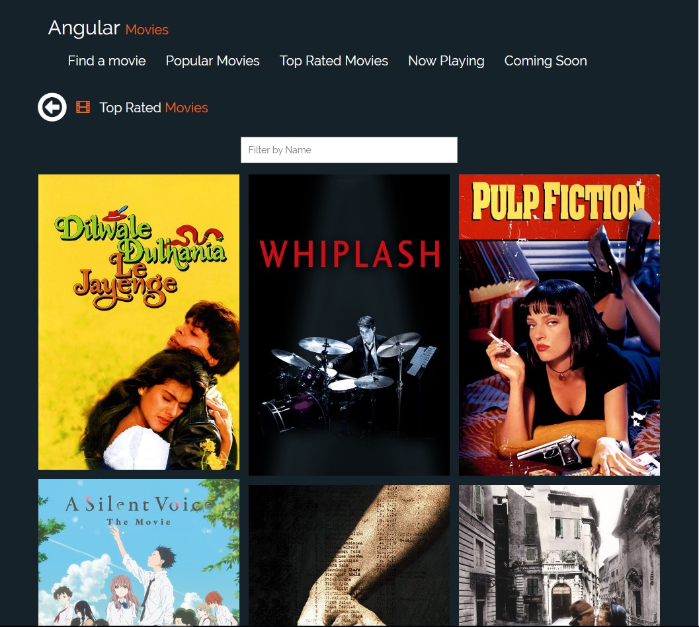

## Angular movies app

Angular movies app is an application built with AngularJS, Bootstrap3 and Flexbox.

It is a part from the curriculum of Skylab Coders Bootcamp.

It contains information for the most rated movies, coming soon movies, popular movies and the movies that are playing now in cinemas.

It uses the TMDB API

You can try the app here -> https://devtoni.github.io/angular-movies-app/.